# Systematic Activation Screening of the Elements Under DT Fusion Neutron Irradiation Using OpenMC

**Jonathan Shimwell**

## Abstract

We present a systematic survey of neutron activation for all stable elements
(Z = 1–83) under conditions representative of a deuterium-tritium (DT) fusion
power plant first wall. Using OpenMC's transport-free material depletion
capability, each element is irradiated with the HCPB first-wall neutron
spectrum (LLNL-616 group structure) at 1 MW/m² wall loading for 40 full-power
years, followed by cooling periods from shutdown to 100 years. We report
specific activity (Bq/kg) and photon contact dose rate (Sv/hr) at ten cooling
times, visualized as color-coded periodic tables. The elemental maps are
validated against established reduced-activation criteria. The results
provide an open-source, reproducible screening tool for fusion material
selection.


## 1. Introduction

Structural materials in a DT fusion power plant are subjected to intense
neutron irradiation dominated by the 14.1 MeV fusion peak. Transmutation of
stable nuclei into radioactive products creates two practical challenges:

1. **Maintenance access** — the photon contact dose rate at the component
   surface determines whether hands-on or remote maintenance is required,
   and the waiting time after shutdown before personnel access.
2. **Waste management** — the specific activity of irradiated material at
   long cooling times determines its waste classification and disposal
   pathway.

The concept of "reduced activation" structural materials was introduced in the
late 1980s and has since guided the
development of fusion-specific alloys such as V–4Cr–4Ti and
SiC/SiC composites. The underlying principle is straightforward: avoid alloying
elements whose isotopes produce long-lived or high-dose activation products
under 14 MeV neutron irradiation.

Despite decades of work, the reduced-activation criteria are typically
presented as tables or lists of acceptable and problematic elements, derived
from detailed calculations with dedicated inventory codes. These results
are authoritative but not always accessible or easy to update with new
nuclear data libraries.

In this work, we take a complementary approach: a systematic, element-by-element
activation screening using OpenMC's transport-free material
depletion capability (`Material.deplete()`), which was contributed to OpenMC
by the author of this report ([PR #3420](https://github.com/openmc-dev/openmc/pull/3420)). By irradiating each element
independently and mapping the results onto periodic tables color-coded by
activity and dose rate, we produce an intuitive visual tool for material
selection. The methodology is fully open-source and reproducible, requiring
only OpenMC and a depletion chain file.


## 2. Methods

### 2.1 Transport-Free Material Depletion

OpenMC (v0.15.3+) provides a `Material.deplete()` method that evolves nuclide
densities under an externally specified multigroup neutron flux without
requiring a full Monte Carlo transport simulation. Internally, the method:

1. Collapses multigroup cross sections from the specified flux spectrum using
   pointwise nuclear data via `MicroXS.from_multigroup_flux()`.
2. Constructs a depletion matrix including neutron reactions and radioactive
   decay.
3. Solves the Bateman equations using the Predictor integrator
   (`PredictorIntegrator`) with the `IndependentOperator`.

This approach is well-suited for parametric activation studies where the
neutron spectrum is known a priori and self-shielding feedback is negligible
— conditions that hold for elemental screening.

### 2.2 Irradiation Conditions

Each element (Z = 1–83, excluding Tc and Pm which have no stable isotopes,
81 elements total) is represented as a pure material at 1 g/cm³ with natural
isotopic composition. Since specific activity (Bq/kg) and contact dose rate
(Sv/hr in the semi-infinite slab model) are independent of density in this
transport-free framework, the density choice is arbitrary.

The irradiation parameters represent a generic DEMO-class fusion power plant
first wall:

| Parameter              | Value                                                            |
|------------------------|------------------------------------------------------------------|
| Neutron spectrum       | HCPB first-wall                                                 |
| Energy group structure | LLNL-616 (616 groups)                                            |
| Wall loading           | 1.0 MW/m²                                                        |
| Scalar flux            | 4.4 × 10¹⁴ n/cm²/s                                              |
| Irradiation time       | 40 full-power years                                              |
| Cooling times          | shutdown, 1 h, 1 d, 1 wk, 1 mo, 1 yr, 5 yr, 10 yr, 50 yr, 100 yr |

The neutron spectrum is the HCPB (Helium-Cooled Pebble Bed) first-wall
reference spectrum, shown in Figure 1. The
spectrum exhibits the characteristic 14.1 MeV DT fusion peak, a broad
scattered/evaporation component in the 0.1–10 MeV range, and resonance
structure at intermediate energies.

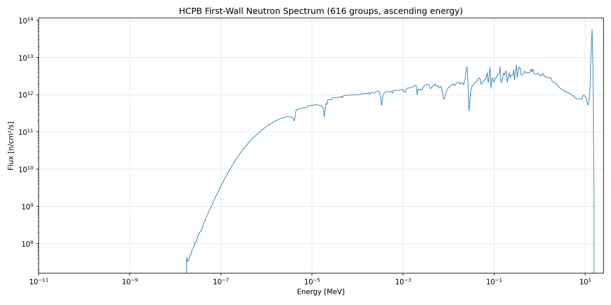
*Figure 1: HCPB first-wall neutron spectrum used for the activation screening.
616 energy groups (LLNL-616 structure), spanning 10⁻⁵ eV to 20 MeV.*

### 2.3 Metrics

Two quantities are computed at each cooling time:

- **Specific activity** [Bq/kg]: total radioactivity per unit mass, relevant
  for waste classification. Computed via `Material.get_activity(units='Bq/kg')`.
- **Photon contact dose rate** [Sv/hr]: effective dose rate at the surface of
  a semi-infinite slab, relevant for maintenance access. Computed via
  `Material.get_photon_contact_dose_rate(dose_quantity='effective')`,
  implementing the semi-infinite slab methodology with ICRP-116 dose
  coefficients and a build-up factor of 2.0.

For each metric, the dominant contributing nuclide is also recorded.


## 3. Results

### 3.1 Elemental Activation Maps

Figures 2–5 show the specific activity periodic tables at key cooling times.

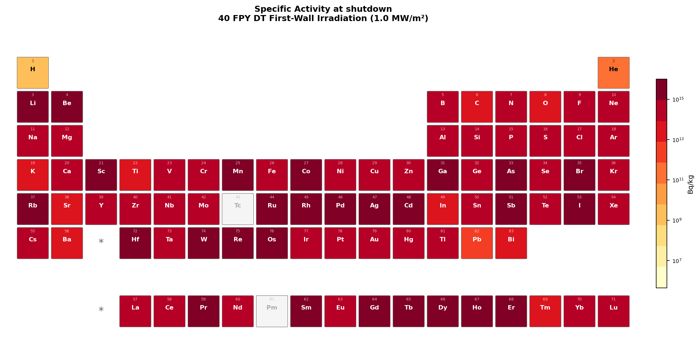
*Figure 2: Specific activity (Bq/kg) at shutdown.*

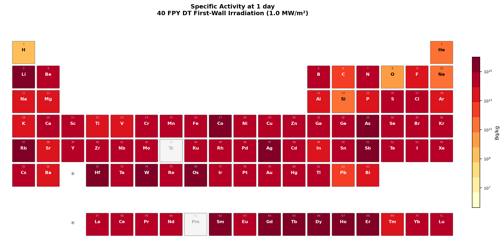
*Figure 3: Specific activity (Bq/kg) at 1 day cooling.*

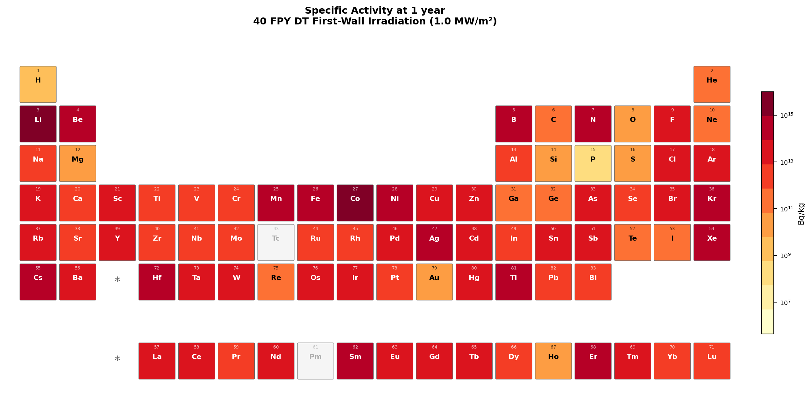
*Figure 4: Specific activity (Bq/kg) at 1 year cooling.*

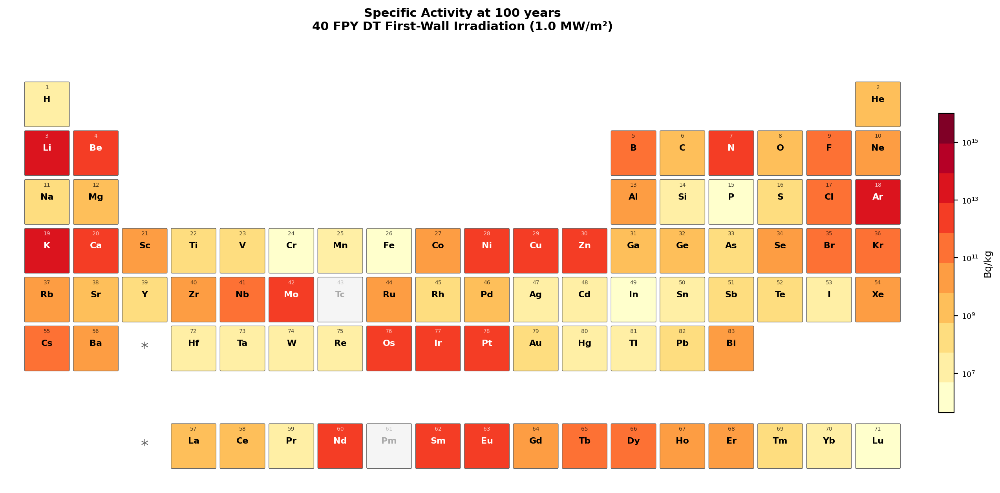
*Figure 5: Specific activity (Bq/kg) at 100 years cooling.*

Figures 6–9 show the contact dose rate periodic tables at the same cooling times.

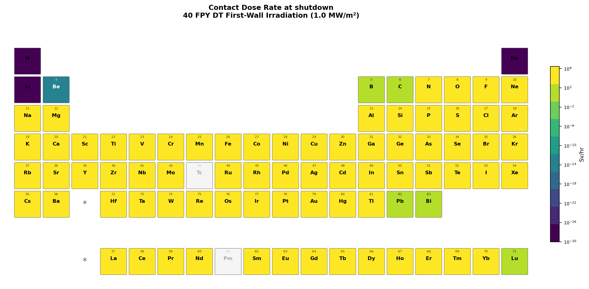
*Figure 6: Contact dose rate (Sv/hr) at shutdown.*

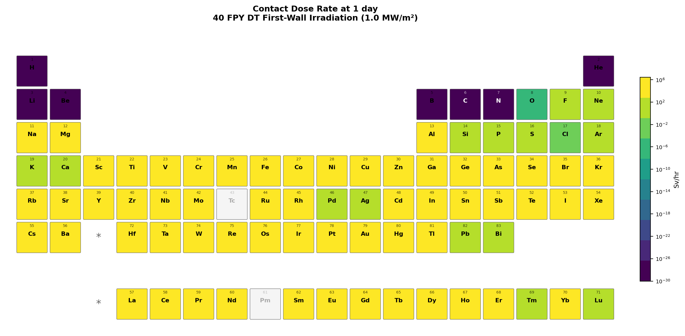
*Figure 7: Contact dose rate (Sv/hr) at 1 day cooling.*

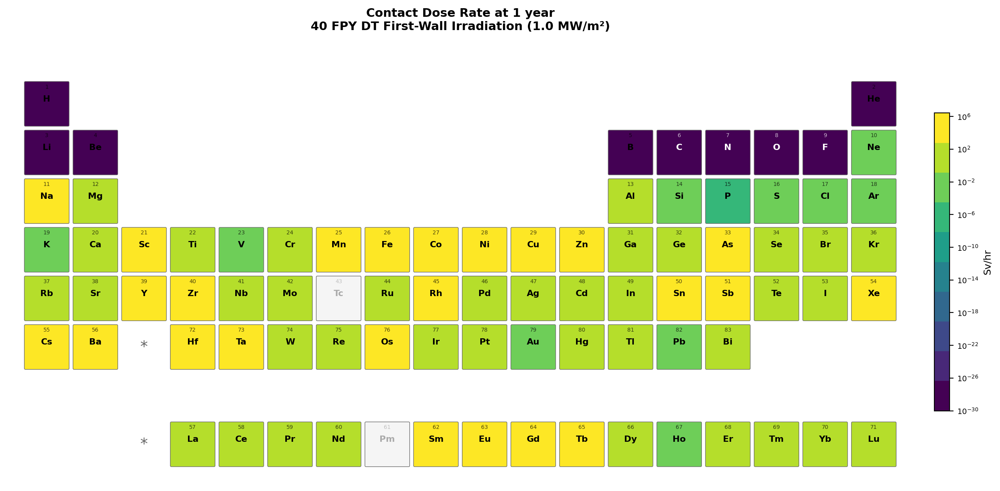
*Figure 8: Contact dose rate (Sv/hr) at 1 year cooling.*

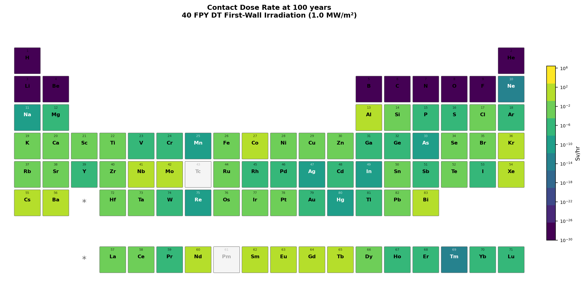
*Figure 9: Contact dose rate (Sv/hr) at 100 years cooling.*

The periodic table heatmaps reveal several patterns consistent with
established reduced-activation knowledge:

- **Low-activation elements** (cool colours): C, Si, Ti, V, Cr, Fe, W, Ta —
  these are the building blocks of reduced-activation alloys.
- **High-activation elements** (hot colours): Co, Ni, Nb, Mo, Ag — these are
  known to produce long-lived activation products (⁶⁰Co, ⁶³Ni, ⁹⁴Nb,
  ⁹⁹Mo→⁹⁹Tc, ¹⁰⁸ᵐAg).
- **Cooling-time dependence**: Many elements appear problematic at shutdown
  but become acceptable at longer cooling times as short-lived products decay.
  The converse is also observed — some elements show persistent long-term
  activity from long-lived products.

### 3.2 Summary: Elements to Avoid

Figures 10–12 identify elements that appear in the top 10 worst performers
at any cooling time, for activity, dose, or both.

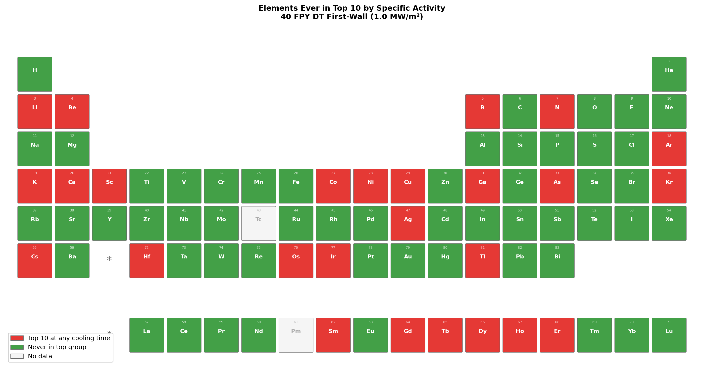
*Figure 10: Elements ever appearing in the top 10 by specific activity.*

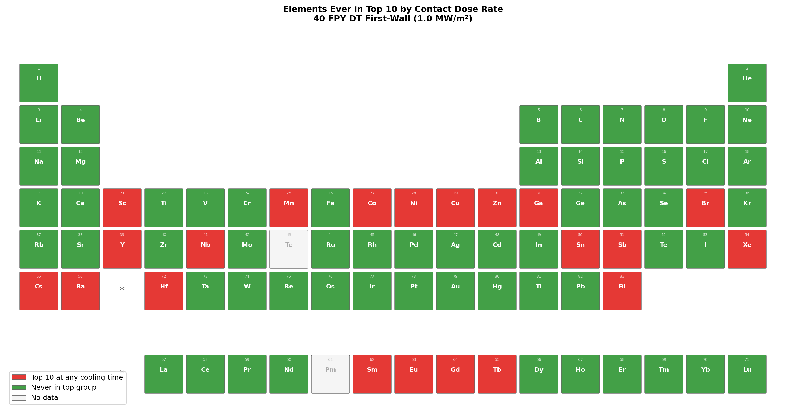
*Figure 11: Elements ever appearing in the top 10 by contact dose rate.*

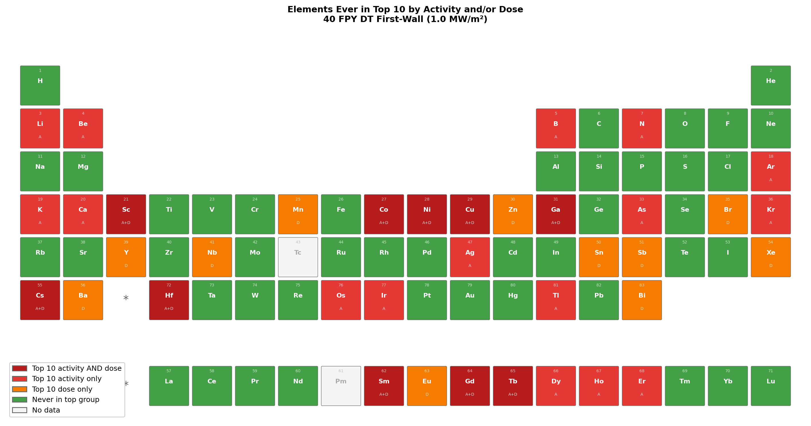
*Figure 12: Elements ever appearing in the top 10 by specific activity
(red), contact dose rate (orange), or both (dark red) at any cooling time.
Green elements are never in the top 10 for either metric.*

### 3.3 Cooling Time Dependence

The ranking of elements changes significantly with cooling time:

- At **shutdown**: Activity is dominated by short-lived products. Most
  transition metals show high activity.
- At **1 day to 1 month**: Relevant for maintenance scheduling. Elements
  producing products with half-lives of hours to weeks determine when
  access is possible.
- At **1 year to 100 years**: Relevant for waste disposal. The problematic
  elements at these timescales are those producing long-lived isotopes
  (e.g., ⁶⁰Co from Co, ⁶³Ni from Ni, ⁹⁴Nb from Nb).

### 3.4 Dominant Contributing Nuclides

[Table: Top contributing nuclides at 1 year and 100 years for key structural
elements — to be populated from `element_data.json`]


## 4. Discussion

### 4.1 Implications for Alloy Design

The periodic table heatmaps directly inform alloy design by providing an
**activation penalty factor** for each element. For example, if element A
has 100× the specific activity of element B at 100-year cooling, then
0.1 wt% of A in a steel contributes the same waste burden as 10 wt% of B.
This framing is immediately actionable for metallurgists selecting
alloying additions.

Impurity specifications are also highlighted: trace elements like Co and Ag,
even at ppm levels, can dominate long-term activation. The maps make this
visually clear and may support more stringent impurity specifications for
fusion-grade materials.

### 4.2 Limitations

- **Chain file completeness**: Results depend on the depletion chain file
  covering all relevant reaction pathways and decay chains. A comprehensive
  fusion activation chain should be used.
- **Single-element assumption**: Cross-element transmutation paths (e.g.,
  element A transmuting into a nuclide that is also produced from element B)
  are not captured in the elemental screening. For typical alloy compositions
  where alloying additions are dilute, this is expected to be a minor effect.
- **Transport-free**: No self-shielding or spatial effects. Valid for thin
  first-wall structures where the flux is externally determined.
- **No Bremsstrahlung**: The contact dose calculation omits Bremsstrahlung
  contributions, which may be relevant for beta-emitters in close proximity.


## 5. Conclusions

We have demonstrated a systematic, open-source approach to fusion material
activation screening using OpenMC's transport-free depletion capability.
The element-by-element periodic table visualization provides an intuitive
tool for material selection that:

1. Reproduces established reduced-activation criteria.
2. Quantifies activation penalty factors for each element at multiple
   cooling times.
3. Is fully reproducible with openly available tools.

The scripts and data are provided as supplementary material. Users can
regenerate the analysis with different spectra, irradiation conditions, or
nuclear data libraries by modifying the input parameters.


## References

- Romano, P.K. et al. (2015). "OpenMC: A state-of-the-art Monte Carlo code
  for research and development." Annals of Nuclear Energy, 82, 90–97.
- ICRP Publication 116 (2010). "Conversion coefficients for radiological
  protection quantities for external radiation exposures."
- UKAEA. "Reference input spectra." Available at:
  https://fispact.ukaea.uk/wiki/Reference_input_spectra


## Appendix: Reproducing This Analysis

```bash
# 1. Generate elemental activation data (test: 10 elements)
python generate_data.py --test \
  --chain /path/to/chain-endf-b8.0.xml \
  --cross_sections /path/to/cross_sections.xml \
  --spectrum hcpb_fw_616.txt

# 2. Plot the input spectrum
python plot_spectrum.py

# 3. Generate periodic table visualizations
python plot_periodic_table.py

# Full run (all 81 elements):
python generate_data.py \
  --chain /path/to/chain-endf-b8.0.xml \
  --cross_sections /path/to/cross_sections.xml \
  --spectrum hcpb_fw_616.txt
python plot_periodic_table.py
```

Requirements: OpenMC >= 0.15.3, numpy, matplotlib, ENDF/B-VIII.0 cross sections
and depletion chain, HCPB-FW spectrum file.

Other neutron spectra are available from the
[reference input spectra](https://fispact.ukaea.uk/wiki/Reference_input_spectra)
and can be used in place of the HCPB first-wall spectrum by passing a different
file to the `--spectrum` argument.
