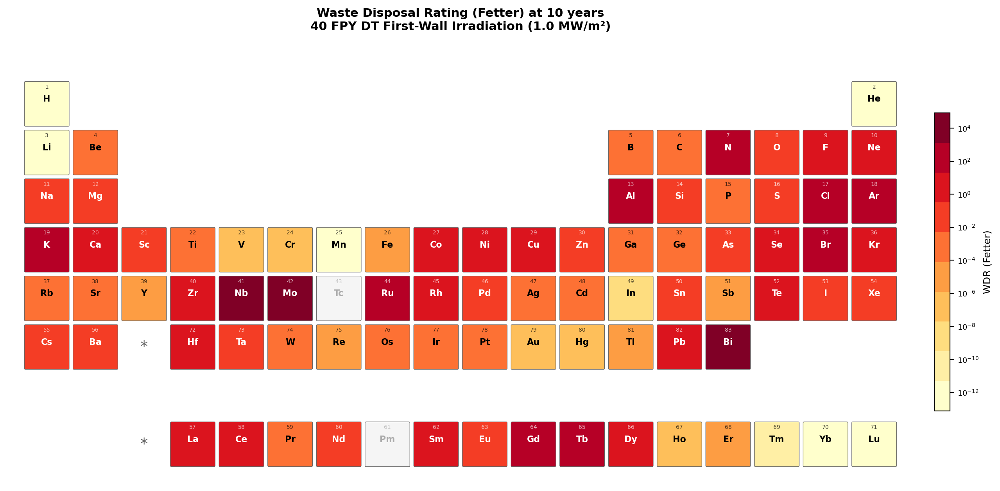
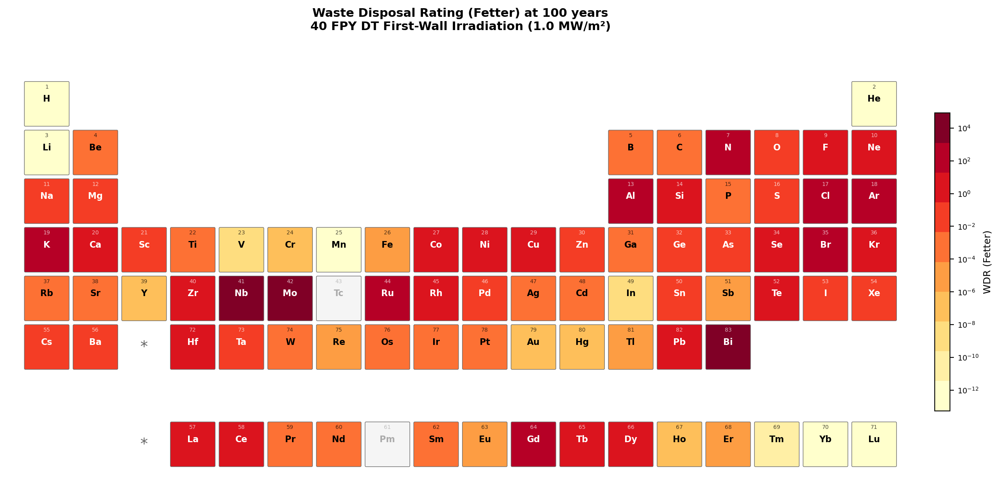
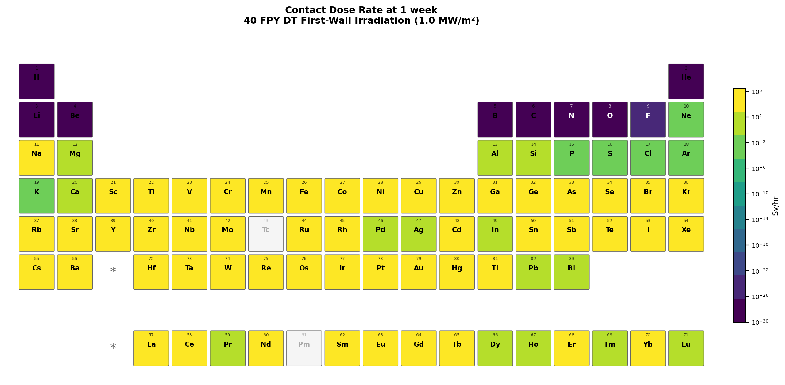
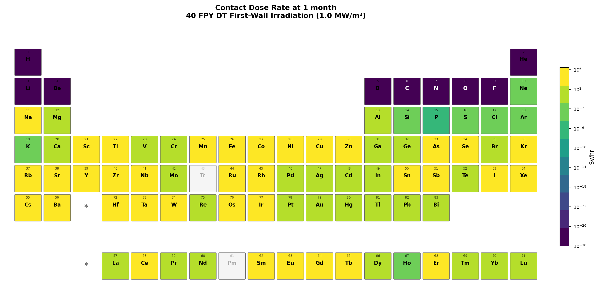
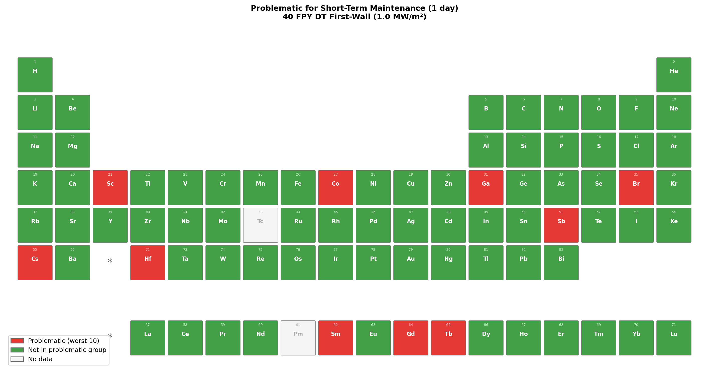
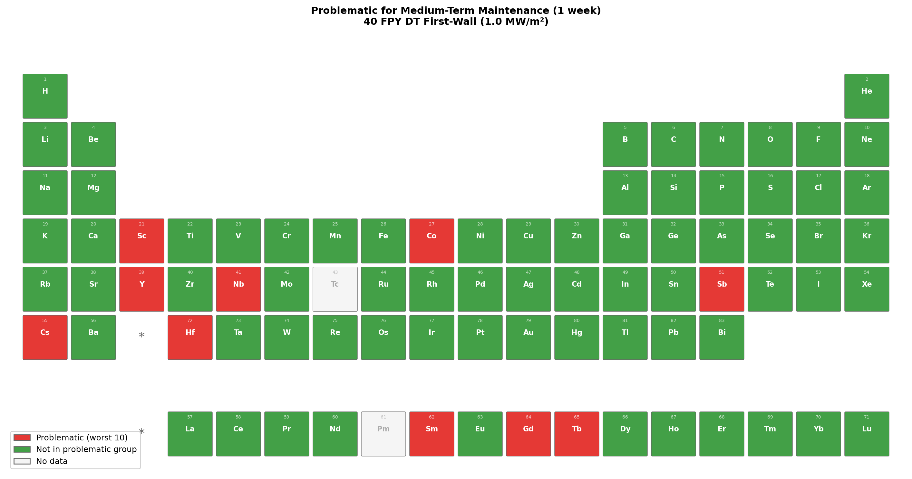
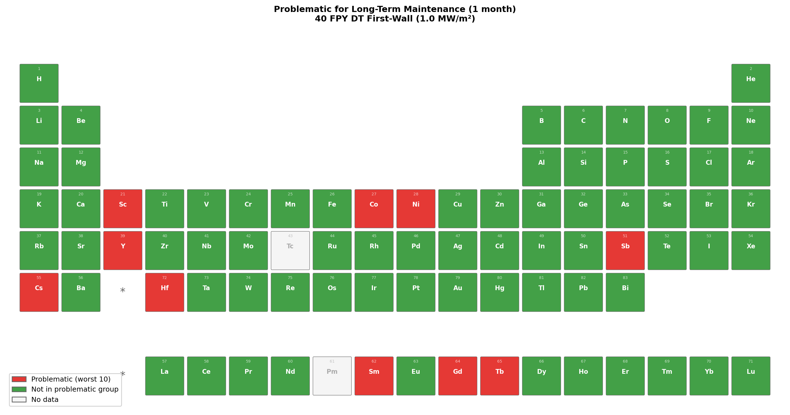
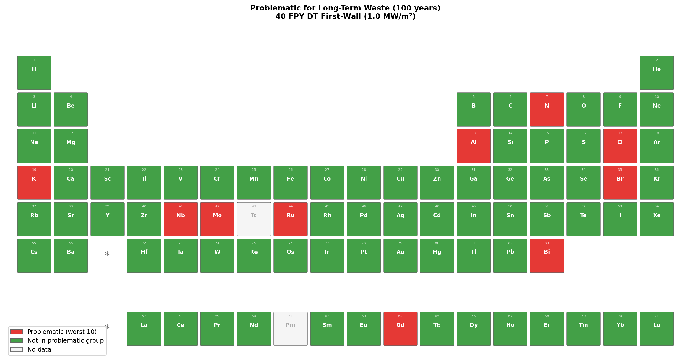

# Systematic Activation Screening of the Elements Under DT Fusion Neutron Irradiation Using OpenMC

**Jonathan Shimwell**

## Abstract

We present a systematic survey of neutron activation for all stable elements
(Z = 1–83) under conditions representative of a deuterium-tritium (DT) fusion
power plant first wall. Using OpenMC's transport-free material depletion
capability, each element is irradiated with the HCPB first-wall neutron
spectrum (LLNL-616 group structure) at 1 MW/m² wall loading for 40 full-power
years, followed by cooling periods from shutdown to 100 years. We report
waste disposal rating (Fetter limits) and photon contact dose rate (Sv/hr)
at cooling times relevant to waste management and maintenance respectively,
visualized as color-coded periodic tables. The results provide an open-source,
reproducible screening tool for fusion material selection.


## 1. Introduction

Structural materials in a DT fusion power plant are subjected to intense
neutron irradiation dominated by the 14.1 MeV fusion peak. Transmutation of
stable nuclei into radioactive products creates two practical challenges:

1. **Maintenance access** — the photon contact dose rate at the component
   surface determines whether hands-on or remote maintenance is required,
   and the waiting time after shutdown before personnel access.
2. **Waste management** — the waste disposal rating of irradiated material at
   long cooling times determines whether it can be disposed of as low-level
   waste or requires more costly intermediate/high-level waste pathways.

The concept of "reduced activation" structural materials was introduced in the
late 1980s and has since guided the
development of fusion-specific alloys such as V–4Cr–4Ti and
SiC/SiC composites. The underlying principle is straightforward: avoid alloying
elements whose isotopes produce long-lived or high-dose activation products
under 14 MeV neutron irradiation.

### 1.1 Related Work

The literature on fusion material selection can be broadly grouped into three
categories.

**Structural and thermo-mechanical assessments.** A large body of work
addresses the mechanical performance of candidate materials under fusion
conditions — creep strength, irradiation hardening, ductile-to-brittle
transition temperature shifts, helium embrittlement, and compatibility with
coolants. Harries (1992) provided an early evaluation of reduced-activation
options covering ferritic/martensitic steels, vanadium alloys, and SiC/SiC
composites. Victoria et al. (2000) reviewed the development of low-activation
materials at the European level, focusing on radiation damage mechanisms and
alloy development for ferritic-martensitic steels (F82H, EUROFER97), titanium
alloys, vanadium alloys, and SiC/SiC composites. Zinkle and Ghoniem (2000)
gave an overview of materials research for fusion reactors covering mechanical
property requirements and irradiation effects. More recently, Gorley (2015)
assessed prospects for reduced-activation steels for fusion plant, and
Şahin (2019) reviewed selection criteria for fusion reactor structures
including DPA cross-sections, helium production, and thermo-mechanical
performance of candidate alloys. Alba et al. (2022) surveyed materials for
future magnetic confinement fusion reactors. While these works are essential
for establishing which materials can survive the fusion environment, they
generally do not present quantitative radiological screening — activity levels,
contact dose rates, or waste disposal classifications are either absent or
treated qualitatively.

**Activation and inventory calculations.** Noda (1988) was among the first to
systematically screen elements for reduced activation under fusion neutron
irradiation. The European Activation System (EASY) with the FISPACT inventory
code has been used extensively for element-by-element activation surveys,
and the UKAEA compilation (Gilbert et al., CCFE-R(16)36) provides the most
comprehensive existing dataset of specific activity and contact dose rate for
all stable elements under several fusion-relevant spectra. These surveys
produce detailed inventory data (Bq/kg, Sv/hr) at multiple cooling times, but
the results are typically presented as raw activity or dose values that require
further interpretation to assess waste disposal implications. Furthermore,
these calculations rely on closed-source inventory codes (FISPACT), making
independent reproduction difficult.

**Shutdown dose rate methods.** A separate strand of work focuses on shutdown
dose rate (SDR) analysis for specific reactor designs, coupling neutron
transport with activation and photon transport. Palermo et al. developed the
Advanced D1S method for SDR assessment of the European DCLL DEMO, and
Bae et al. demonstrated SDR analysis with the Shift Monte Carlo code at ORNL.
These are geometry-specific calculations for particular reactor designs rather
than element-level screening tools.

### 1.2 Contribution of This Work

Despite the breadth of existing work, there is a gap between elemental
activation surveys that report raw activity (Bq/kg) and the actionable
metrics that engineers need for material selection decisions: *can this
material qualify as low-level waste?* and *when can maintenance workers access
this component?*

In this work, we bridge that gap by combining element-by-element activation
screening with two directly actionable metrics: waste disposal rating (Fetter
limits, where a value below 1.0 means the material meets low-level waste
criteria) and contact dose rate (Sv/hr). By mapping these onto color-coded
periodic tables at timescales relevant to each metric — years to decades for
waste, days to weeks for maintenance — we produce an intuitive visual tool
that compresses the output of detailed inventory calculations into immediate
design guidance.

A key differentiator of this work is that the underlying capabilities —
transport-free material depletion (`Material.deplete()`,
[PR #3420](https://github.com/openmc-dev/openmc/pull/3420)), waste disposal
rating (`Material.waste_disposal_rating()`,
[PR #3366](https://github.com/openmc-dev/openmc/pull/3366)), and contact dose
rate (`Material.get_photon_contact_dose_rate()`) — have been contributed to
OpenMC by the author of this report and are available to all users of the
open-source code. This means the entire analysis is fully reproducible and
transparent: anyone can inspect the methodology, verify the results, or extend
the study. Users can select their own continuous-energy cross section libraries
and depletion chain files, making it straightforward to repeat the analysis
with different nuclear data evaluations (e.g. TENDL, JEFF) or updated chain
files as they become available.


## 2. Methods

### 2.1 Transport-Free Material Depletion

OpenMC version 0.15.3 development branch (commit `15786981`) was used for this
analysis. OpenMC provides a `Material.deplete()` method that evolves nuclide
densities under an externally specified multigroup neutron flux without
requiring a full Monte Carlo transport simulation. Internally, the method:

1. Collapses multigroup cross sections from the specified flux spectrum using
   pointwise nuclear data via `MicroXS.from_multigroup_flux()`.
2. Constructs a depletion matrix including neutron reactions and radioactive
   decay.
3. Solves the Bateman equations using the Predictor integrator
   (`PredictorIntegrator`) with the `IndependentOperator`.

This approach is well-suited for parametric activation studies where the
neutron spectrum is known a priori and self-shielding feedback is negligible
— conditions that hold for elemental screening.

### 2.2 Nuclear Data

Cross sections and depletion chain data are derived from the ENDF/B-VIII.0
nuclear data library. Pointwise neutron cross sections are used for spectrum
collapsing, and the depletion chain file (`chain-endf-b8.0.xml`) provides
the transmutation and decay pathways. The chain is reduced per element to
nuclides reachable within 5 transmutation steps from the element's natural
isotopes, balancing completeness against computational cost.

### 2.3 Irradiation Conditions

Each element (Z = 1–83, excluding Tc and Pm which have no stable isotopes,
81 elements total) is represented as a pure material at 1 g/cm³ with natural
isotopic composition. Since contact dose rate (Sv/hr in the semi-infinite
slab model) is independent of density in this transport-free framework, the
density choice is arbitrary.

The irradiation parameters represent a generic DEMO-class fusion power plant
first wall:

| Parameter              | Value                                                            |
|------------------------|------------------------------------------------------------------|
| Neutron spectrum       | HCPB first-wall                                                 |
| Energy group structure | LLNL-616 (616 groups)                                            |
| Wall loading           | 1.0 MW/m²                                                        |
| Scalar flux            | 4.4 × 10¹⁴ n/cm²/s                                              |
| Irradiation time       | 40 full-power years                                              |
| Cooling times          | shutdown, 1 h, 1 d, 1 wk, 1 mo, 1 yr, 5 yr, 10 yr, 50 yr, 100 yr |

The neutron spectrum is the HCPB (Helium-Cooled Pebble Bed) first-wall
reference spectrum, shown in Figure 1. The
spectrum exhibits the characteristic 14.1 MeV DT fusion peak, a broad
scattered/evaporation component in the 0.1–10 MeV range, and resonance
structure at intermediate energies.


*Figure 1: HCPB first-wall neutron spectrum used for the activation screening.
616 energy groups (LLNL-616 structure), spanning 10⁻⁵ eV to 20 MeV.*

### 2.4 Metrics

Two quantities are computed at each cooling time:

- **Waste disposal rating** (dimensionless): the sum-of-fractions ratio of
  each nuclide's specific activity to its Fetter disposal limit. A value
  below 1.0 means the material meets low-level waste disposal criteria; above
  1.0 it exceeds them. Computed via `Material.waste_disposal_rating()` using
  the Fetter limits (Fetter et al. 1990), which extend the US 10 CFR 61
  methodology to fusion-relevant long-lived radionuclides. Plotted at
  waste-relevant timescales: 1 year, 10 years, 100 years.
- **Photon contact dose rate** [Sv/hr]: effective dose rate at the surface of
  a semi-infinite slab, relevant for maintenance access. Computed via
  `Material.get_photon_contact_dose_rate(dose_quantity='effective')`,
  implementing the semi-infinite slab methodology with ICRP-116 dose
  coefficients and a build-up factor of 2.0. Plotted at maintenance-relevant
  timescales: 1 day, 1 week, 1 month.

For each metric, the dominant contributing nuclide is also recorded.


## 3. Results

### 3.1 Waste Disposal Rating Maps

Figures 2–4 show the waste disposal rating periodic tables at long-term
cooling times relevant to waste management.


*Figure 2: Waste disposal rating (Fetter limits) at 1 year cooling.*


*Figure 3: Waste disposal rating (Fetter limits) at 10 years cooling.*


*Figure 4: Waste disposal rating (Fetter limits) at 100 years cooling.*

### 3.2 Contact Dose Rate Maps

Figures 5–7 show the contact dose rate periodic tables at maintenance-relevant
cooling times.


*Figure 5: Contact dose rate (Sv/hr) at 1 day cooling.*


*Figure 6: Contact dose rate (Sv/hr) at 1 week cooling.*


*Figure 7: Contact dose rate (Sv/hr) at 1 month cooling.*

The periodic table heatmaps reveal several patterns consistent with
established reduced-activation knowledge:

- **Low-activation elements** (cool colours): C, Si, Ti, V, Cr, Fe, W, Ta —
  these are the building blocks of reduced-activation alloys.
- **High-activation elements** (hot colours): Co, Ni, Nb, Mo, Ag — these are
  known to produce long-lived activation products (⁶⁰Co, ⁶³Ni, ⁹⁴Nb,
  ⁹⁹Mo→⁹⁹Tc, ¹⁰⁸ᵐAg).
- **Cooling-time dependence**: Many elements appear problematic at short
  cooling times but become acceptable at longer times as short-lived products
  decay. The converse is also observed — some elements show persistent
  long-term waste disposal issues from long-lived products.

### 3.3 Summary: Problematic Elements

Figures 8–13 identify the 10 most problematic elements at each timescale for
maintenance dose and waste disposal.


*Figure 8: Problematic elements for short-term maintenance (1 day).*


*Figure 9: Problematic elements for medium-term maintenance (1 week).*


*Figure 10: Problematic elements for long-term maintenance (1 month).*


*Figure 11: Problematic elements for short-term waste (1 year).*


*Figure 12: Problematic elements for medium-term waste (10 years).*


*Figure 13: Problematic elements for long-term waste (100 years).*

Figure 14 combines all timescales into a single summary, showing elements that
are problematic for waste disposal, maintenance dose, or both.


*Figure 14: Combined summary — elements problematic for waste (red),
maintenance dose (orange), or both (dark red) across all timescales.
Green elements are never in the problematic group for either metric.*

### 3.4 Cooling Time Dependence

The choice of different timescales for each metric reflects their distinct
practical relevance:

- At **1 day to 1 month** (maintenance): Elements producing products with
  half-lives of hours to weeks determine when hands-on access is possible.
  The ranking changes as short-lived products decay through these timescales.
- At **1 year to 100 years** (waste): The problematic elements at these
  timescales are those producing long-lived isotopes (e.g., ⁶⁰Co from Co,
  ⁶³Ni from Ni, ⁹⁴Nb from Nb). A waste disposal rating above 1.0 at any
  of these timescales indicates the material cannot qualify as low-level waste
  under Fetter limits.

### 3.5 Dominant Contributing Nuclides

Tables 1 and 2 show the waste disposal rating, contact dose rate, and dominant
contributing nuclides for key structural and alloying elements at 1 year and
100 years cooling.

*Table 1: Dominant nuclides at 1 year cooling.*

| Element | WDR       | Dominant (WDR) | Dose (Sv/hr) | Dominant (dose) |
|---------|-----------|----------------|--------------|-----------------|
| Fe      | 2.80e-05  | Co-60          | 2.41e+03     | Mn-54           |
| Cr      | 3.63e-08  | Ar-39          | 2.70e+00     | Mn-54           |
| W       | 5.43e-04  | Hf-182         | 3.44e+02     | Ta-182          |
| V       | 1.01e-07  | Ar-42          | 1.16e-01     | Sc-46           |
| Ti      | 7.07e-04  | Ar-39          | 5.95e+02     | Sc-46           |
| Ni      | 9.02e-01  | Ni-59          | 4.54e+04     | Co-60           |
| Co      | 6.29e-01  | Ni-59          | 2.27e+06     | Co-60           |
| Mo      | 4.21e+03  | Tc-99          | 1.23e+01     | Y-88            |
| Nb      | 8.34e+04  | Nb-94          | 3.41e+02     | Nb-94           |
| Ta      | 4.06e-02  | Hf-182         | 2.76e+03     | Ta-182          |
| Cu      | 6.37e-01  | Ni-63          | 1.18e+04     | Co-60           |
| Al      | 1.02e+02  | Al-26          | 9.85e-01     | Na-22           |
| Si      | 2.97e-01  | Al-26          | 7.73e-03     | Na-22           |
| Mn      | 5.43e-13  | Ar-42          | 3.06e+04     | Mn-54           |

*Table 2: Dominant nuclides at 100 years cooling.*

| Element | WDR       | Dominant (WDR) | Dose (Sv/hr) | Dominant (dose) |
|---------|-----------|----------------|--------------|-----------------|
| Fe      | 6.55e-06  | Ni-59          | 3.81e-04     | Co-60           |
| Cr      | 2.31e-08  | Ar-39          | 6.12e-08     | K-42            |
| W       | 5.43e-04  | Hf-182         | 1.59e-06     | Ta-182          |
| V       | 1.43e-08  | Ar-42          | 7.80e-07     | K-42            |
| Ti      | 4.61e-04  | Ar-39          | 1.06e-03     | K-42            |
| Ni      | 8.08e-01  | Ni-59          | 9.74e-02     | Co-60           |
| Co      | 3.38e-01  | Ni-59          | 5.02e+00     | Co-60           |
| Mo      | 4.18e+03  | Tc-99          | 1.10e+00     | Nb-91           |
| Nb      | 8.31e+04  | Nb-94          | 2.42e+02     | Nb-94           |
| Ta      | 4.06e-02  | Hf-182         | 1.11e-04     | Ta-182          |
| Cu      | 4.32e-01  | Fe-60          | 2.56e-02     | Co-60           |
| Al      | 1.02e+02  | Al-26          | 2.50e-01     | Al-26           |
| Si      | 2.97e-01  | Al-26          | 7.04e-04     | Al-26           |
| Mn      | 7.09e-14  | Ar-42          | 4.22e-12     | K-42            |

Notable observations:

- **Fe, Cr, V, Mn** all have WDR well below 1.0 at both timescales —
  confirming their suitability as reduced-activation structural elements.
- **Ni and Co** approach or exceed WDR = 1.0 due to Ni-59 and Ni-63
  production, while Co-60 drives extreme contact dose rates.
- **Nb and Mo** are the worst performers by WDR (8.3×10⁴ and 4.2×10³
  respectively), driven by Nb-94 and Tc-99 — long-lived products with
  no practical decay within engineering timescales.
- **Al** exceeds WDR = 1.0 due to Al-26 (half-life 7.2×10⁵ years),
  which persists unchanged from 1 year to 100 years.


## 4. Discussion

### 4.1 Implications for Alloy Design

The periodic table heatmaps directly inform alloy design by providing a
**waste disposal penalty** for each element. For example, if element A has
a waste disposal rating of 1000 and element B has a rating of 1, then even
a small fraction of A in an alloy will dominate the waste classification.
This framing is immediately actionable for metallurgists selecting
alloying additions.

Impurity specifications are also highlighted: trace elements like Co and Ag,
even at ppm levels, can dominate long-term activation. The maps make this
visually clear and may support more stringent impurity specifications for
fusion-grade materials.

### 4.2 Limitations

- **Chain file completeness**: Results depend on the depletion chain file
  covering all relevant reaction pathways and decay chains. A comprehensive
  fusion activation chain should be used.
- **Single-element assumption**: Cross-element transmutation paths (e.g.,
  element A transmuting into a nuclide that is also produced from element B)
  are not captured in the elemental screening. For typical alloy compositions
  where alloying additions are dilute, this is expected to be a minor effect.
- **Transport-free**: No self-shielding or spatial effects. Valid for thin
  first-wall structures where the flux is externally determined.
- **No Bremsstrahlung**: The contact dose calculation omits Bremsstrahlung
  contributions, which may be relevant for beta-emitters in close proximity.
- **Fetter limits scope**: The Fetter limits cover a specific set of
  fusion-relevant nuclides. Nuclides not in the Fetter list do not contribute
  to the waste disposal rating, even if they are radioactive.


## 5. Conclusions

We have demonstrated a systematic, open-source approach to fusion material
activation screening using OpenMC's transport-free depletion capability.
The element-by-element periodic table visualization provides an intuitive
tool for material selection that:

1. Reproduces established reduced-activation criteria.
2. Quantifies waste disposal ratings (Fetter limits) and contact dose rates
   for each element at relevant cooling times.
3. Separates maintenance-relevant timescales (days to months) from
   waste-relevant timescales (years to decades).
4. Is fully reproducible with openly available tools.

The scripts and data are provided as supplementary material. Users can
regenerate the analysis with different spectra, irradiation conditions, or
nuclear data libraries by modifying the input parameters.


## References

- Alba, G. et al. (2022). "Materials to Be Used in Future Magnetic Confinement
  Fusion Reactors." Materials, 15, 6853.
  DOI: [10.3390/ma15196853](https://doi.org/10.3390/ma15196853)
- Bae, J.W. et al. (2023). "Shutdown Dose Rate Analysis with the Shift Monte
  Carlo Code." ORNL report. <!-- TODO: confirm exact report number -->
- Brown, D.A. et al. (2018). "ENDF/B-VIII.0: The 8th major release of the
  nuclear reaction data library with CIELO-project cross sections, new
  standards and thermal scattering data." Nuclear Data Sheets, 148, 1–142.
- Fetter, S., Cheng, E.T., Mann, F.M. (1990). "Long-term radioactive waste
  from fusion reactors: Part II." Fusion Engineering and Design, 13, 239–248.
- Gilbert, M.R. et al. (2016). "Handbook of Activation, Transmutation, and
  Radiation Damage Properties of the Elements Simulated Using FISPACT-II &
  TENDL-2015." CCFE-R(16)36, UKAEA.
  Available at: https://scientific-publications.ukaea.uk/wp-content/uploads/CCFE-R1636.pdf
- Gorley, M.J. (2015). "Prospects for reduced activation steel for fusion
  plant." Materials Research Innovations, 19:5.
  DOI: [10.1179/1743284714Y.0000000732](https://doi.org/10.1179/1743284714Y.0000000732)
- Harries, D.R. (1992). "Evaluation of reduced-activation options for fusion
  reactors." Journal of Nuclear Materials, 191–194, 255–260.
  DOI: [10.1016/0022-3115(92)90331-7](https://doi.org/10.1016/0022-3115(92)90331-7)
- ICRP Publication 116 (2010). "Conversion coefficients for radiological
  protection quantities for external radiation exposures."
- Noda, T. (1988). "Materials selection for reduced activation of fusion
  reactors." Journal of Nuclear Materials, 155–157, 722–729.
  DOI: [10.1016/0022-3115(88)90375-3](https://doi.org/10.1016/0022-3115(88)90375-3)
- Palermo, I. et al. "Shutdown dose rate assessment with the Advanced D1S
  method for the European DCLL DEMO." EUROfusion report.
  <!-- TODO: confirm exact citation / DOI -->
- Romano, P.K. et al. (2015). "OpenMC: A state-of-the-art Monte Carlo code
  for research and development." Annals of Nuclear Energy, 82, 90–97.
- Şahin, S. (2019). "Selection Criteria for Fusion Reactor Structures."
  Journal of Thermal Engineering, 5(2), Special Issue 9, 46–57.
- Victoria, M., Baluc, N., Spätig, P. (2000). "Structural Materials for
  Fusion Reactors." Proc. IAEA TCM on Fusion Reactor Materials, Stresa.
  Available at: https://www-pub.iaea.org/MTCD/publications/PDF/csp_008c/pdf/ftp1_13.pdf
  <!-- TODO: confirm exact proceedings title / page numbers -->
- UKAEA. "Reference input spectra." Available at:
  https://fispact.ukaea.uk/wiki/Reference_input_spectra
- Zinkle, S.J., Ghoniem, N.M. (2000). "Overview of materials research for
  fusion reactors." Fusion Engineering and Design, 51–52, 55–71.
  DOI: [10.1016/S0920-3796(00)00319-3](https://doi.org/10.1016/S0920-3796(00)00319-3)


## Appendix: Reproducing This Analysis

```bash
# 1. Generate elemental activation data (test: 10 elements)
python generate_data.py --test \
  --chain /path/to/chain-endf-b8.0.xml \
  --cross_sections /path/to/cross_sections.xml \
  --spectrum hcpb_fw_616.txt

# 2. Plot the input spectrum
python plot_spectrum.py

# 3. Generate periodic table visualizations
python plot_periodic_table.py

# Full run (all 81 elements):
python generate_data.py \
  --chain /path/to/chain-endf-b8.0.xml \
  --cross_sections /path/to/cross_sections.xml \
  --spectrum hcpb_fw_616.txt
python plot_periodic_table.py
```

Requirements: OpenMC >= 0.15.3, numpy, matplotlib, ENDF/B-VIII.0 cross sections
and depletion chain, HCPB-FW spectrum file.

Other neutron spectra are available from the
[reference input spectra](https://fispact.ukaea.uk/wiki/Reference_input_spectra)
and can be used in place of the HCPB first-wall spectrum by passing a different
file to the `--spectrum` argument.


## TODO

Items to resolve before finalising:

### Reference details to confirm
- Bae, J.W. et al. — confirm exact ORNL report number / year for "Shutdown
  Dose Rate Analysis with the Shift Monte Carlo Code"
- Palermo, I. et al. — confirm exact citation, year, and DOI for "Shutdown
  dose rate assessment with the Advanced D1S method for the European DCLL DEMO"
- Victoria, M. et al. (2000) — confirm exact proceedings title and page
  numbers for IAEA TCM paper "Structural Materials for Fusion Reactors"

### Papers to read and potentially cite in Section 1.1
- Gilbert, M.R. et al. CCFE-R(16)36 — full frosted PDF (>10 MB) could not be fetched;
  read and verify summary of content, confirm if later TENDL-2017 or
  TENDL-2019 updates were published as separate reports
- Piet, S.J., Cheng, E.T., Herring, S. (late 1980s) — original
  reduced-activation element screening work; check if this should be cited
  alongside Noda (1988)
- Conn, R.W. et al. (1983) "Panel report on low activation materials for
  fusion applications" — early foundational work on the concept
- Ehrlich, K. (1999) Phil. Trans. R. Soc. Lond. A 357, 595 — referenced by
  Victoria et al.; may be relevant as a review of reduced-activation criteria
- Any Khripunov or ITER material selection reports that cover element-level
  activation screening
